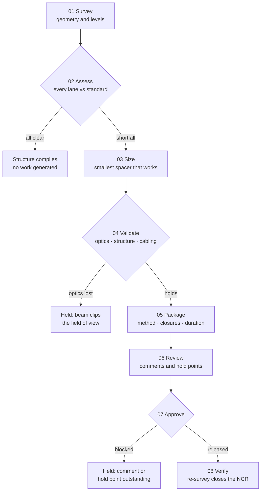

# gantry-clearance-assurance

**Overhead gantry vertical-clearance assurance, end to end.** Survey the
structure, assess the clearance lane by lane against a standard, size the
smallest remediation that works, prove it does not break the sensor optics,
package the change, run it through design review, gate the approval, and verify
it on site.

The problem is deceptively small. A tolling gantry hangs cameras, illuminators
and transceivers below its girder. If the lowest of them sits even 100 mm too
close to the road, the structure is non-conforming — and fixing it means
threading a change through structural review, non-conformance reporting,
certified drawings, a night possession and a verification survey. Getting the
engineering right is the easy half.

Zero third-party dependencies. Standard library + `pytest` only, 75 tests.
The demo is a single self-contained HTML file that runs the whole process on a
true-scale engineering elevation.

> The demo is not a mock-up. Its JavaScript is a direct port of the same engine
> and produces identical results to the Python package across all six cases.

## What it works out

Clearance is never one number. The girder is **cambered**, so its underside is
highest at mid-span and falls toward the columns. The carriageway has
**crossfall** for drainage, so the road is highest on one side. Those two curves
run in opposite directions, which is why the tightest gap is usually off-centre —
not in the middle, where anyone would think to measure.



## 30-second tour

| You want to… | Look at | What it tells you |
|---|---|---|
| See the problem | Elevation | True-scale section with live dimension lines; the required envelope sweeps across and lanes redline where equipment intrudes |
| Read the numbers | Clearance by lane | Governing item, actual clearance, and how many millimetres on or off the requirement |
| Watch the fix | Spacer slider | Drag it and the equipment lifts, dimensions recompute, lanes flip status |
| Check the catch | Validate stage | Tilt-window arc showing how much of the sensor's usable range the fix consumes |
| Follow the process | Stage spine | Eight stages, each with its own verdict and evidence |
| See what blocks it | Review board | Comments and hold points; approval needs both |
| Read the verdict | Assistant | Priority, headline, actions and the working behind them |

## Domain rules, in brief

- **Camber and crossfall fight each other.** The girder rises to mid-span; the
  road falls across the carriageway. The critical lane is where those two effects
  add up against you.
- **The lowest item governs.** Assessment is per item, not per structure. In
  practice one equipment type is the culprit and the rest clear comfortably —
  finding out which is the whole job.
- **The requirement is a sum, not a number.** A base clearance, a reserve for
  future resurfacing, a survey tolerance and an owner margin. They are kept
  separate because when a structure fails by 40 mm, the first question is which
  of the four the 40 mm came out of.
- **Size from a catalogue, not from scratch.** The smallest stock spacer that
  clears the deficit plus a working margin. Larger is wasted headroom that eats
  into sensor geometry; smaller leaves a lane non-conforming, which is the one
  outcome nobody can sign.
- **Raising a camera costs you optics.** Lift it and it sits further above the
  beam in front of it, so it must look down more steeply to see past. The usable
  tilt window narrows from below. The `overlay_reserved` case shows this biting:
  the stricter standard demands a spacer tall enough to put the beam back in
  shot, and the change is held.
- **Approval needs two different things.** Comments can be closed by discussion.
  **Hold points** cannot — a certified drawing, a raised non-conformance, an
  authority drawing number, a traffic-management agreement. Keeping them apart is
  what stops a review being talked to a close.
- **A verification survey closes the loop.** The change is not finished when it
  is installed; it is finished when it is re-measured.

## Cases

| Case | What it shows |
|---|---|
| `as_surveyed` | Two lanes short by 139 and 38 mm; a 180 mm spacer clears both |
| `undersized_spacer` | A 100 mm spacer against a 139 mm deficit — held at the sizing stage |
| `future_overlay` | 40 mm of new asphalt takes 40 mm straight off every lane |
| `overlay_reserved` | The stricter standard forces a spacer that blinds the camera |
| `flatter_gantry` | Remove the camber and crossfall alone governs |
| `already_compliant` | Nothing short, so nothing is sized and no work is invented |

## Run it

```bash
open demo/index.html          # the end-to-end process on a true-scale elevation
python3 -m pytest -q          # 75 domain-claim tests
./check-sources.sh            # zero-dep + leak + self-contained + tests gate
```

### Streamlit front end

There is also an optional Streamlit app if you want live controls — a sidebar to
switch case, standard and spacer height, with the elevation, lane table, tilt
window, review board and work package updating as you go.

```bash
pip install -r requirements.txt
streamlit run app.py
```

`app.py` holds no engineering logic; it draws what the package returns. That is
why it sits outside `gantry_clearance/` — the package keeps its zero-dependency
promise and the gate keeps enforcing it, while the app is free to depend on
whatever it likes.

## Layout

```
gantry_clearance/
  geometry.py     gantry camber, carriageway crossfall, lanes, module grid
  equipment.py    equipment catalogue and mounting drops
  standards.py    clearance requirements and their allowances
  assess.py       per-item and per-lane conformance, governing item
  remediation.py  spacer catalogue and sizing
  fov.py          sensor tilt window against the obstructing beam
  review.py       comment register, hold points, approval gate
  workpack.py     method, lane closures, possession duration
  pipeline.py     the eight stages, run as one auditable object
  assistant.py    engineering verdict and actions
  scenarios.py    six complete cases
tests/            75 domain claims (pytest)
demo/index.html   self-contained end-to-end demo
check-sources.sh  CI gate: zero-dep + leak + self-contained + tests
```

## A note on the data

Every geometry, level, standard and review comment in this repository is
**synthetic** — built to be representative of how this class of problem actually
behaves, not drawn from any particular structure or project. Clearance
requirements follow published road-authority design criteria; the review themes
are the recurring questions any over-carriageway equipment change attracts.

## License

MIT — see [LICENSE](LICENSE).
